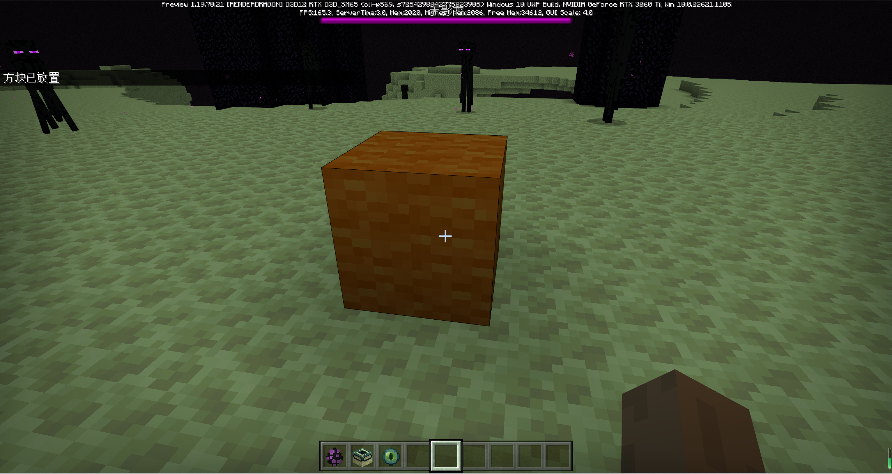
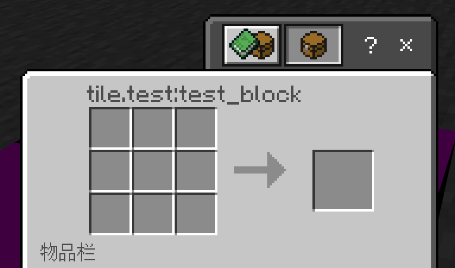
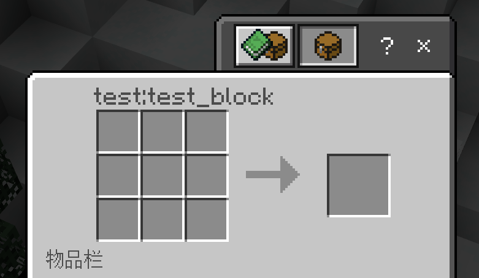

# [2023w02m01a] 命令脚本移除data，脚本接口日常更新

:::info 版本更新
本周官方更新了1.19.70.21版本，[点击这里](/docs/backup/preview/1.19.70.21)查看官方技术更新日志
:::

各位更新好，又到了一周一次的预览版更新，本周的预览版在技术更新方面主要涉及命令、数驱和脚本三个方面的内容，大体上还是日常小改小动。不过话虽如此，其中也不乏一些可能存在深远影响的更改。那么接下来就让我们一起来看看本周官方又给我们更新了什么新特性吧！

## 本周动态速递

- 🎛️ 命令与脚本移除物品data参数，扁平化新阶段？
- 📜 方块加载规则更加日常规范化，参数类型不符直接炸。
- 🗑️ 工作台组件写法简化，和 `tile` 说再见。
- 🔌 函数移除、参数类型更改，脚本接口日常变动。
- 🦦 脚本接口 `Player#playAnimation` 函数加入。

## 一、data退出历史舞台，扁平化进入新阶段？

本周的预览版中，官方移除了对1.19.70版本以上的`/clone`、`/execute`、`/fill`、`/setblock` 和 `/testforblock` 命令以及脚本接口的 `ItemStack` 类中data字段的支持。同时在脚本方面提供了通过字符串新建`ItemStack`对象的方式。这些举措对开发者未来的命令与脚本编写影响还是很大的。

### 命令

首先是命令方面，这里我们借官方给出的例子来简单体会一下：

在以往如果我们想要放置一个橙色的羊毛，我们通常会使用如下命令来进行放置：

````typescript
/setblock ~ ~ ~ minecraft:wool 1
````

其中wool后跟着的1就是橙色羊毛的data值，而现在，这种写法将不再支持。

如果您就是不信这个邪，在新版本中使用了上述写法，则您会得到如下报错：


通过报错信息我们可以明白，问题出在这个“1”上，换言之，游戏引擎已经不认识这个`data`参数了。

那怎么办呢？

这时候，您可以使用状态参数来完成和上面相同的操作：

 ````typescript
 /setblock ~ ~ ~ minecraft:wool ["color":"orange"]
 ````

其中 `color` 是羊毛方块颜色状态的名称。具体每个方块都有什么状态，各位可以在其对应的Minecraft Wiki页面中找到。

执行后得到如下结果：



可以看到橙色羊毛被顺利放置了。

### 脚本

脚本方面主要是 `ItemStack` 类中的 `data` 字段被移除了。

在此之前，如果我们想要创建一个红沙物品堆叠实例，我们需要通过以下方式构造：

```typescript
import {MinecraftItemTypes, ItemStack} from '@minecraft/server';
// 创建一个数量为1的红沙物品堆叠实例
// 目前基岩版中，沙子与红沙共用一个方块id
// 沙子的数据值为0，红沙的数据值为1
const itemStack = new ItemStack(MinecraftItemTypes.sand, 1, 1);
```

但在本周的预览版中，官方移除了 `ItemStack` 的 `data` 属性以及其构造函数中的 `data` 参数。在这种情况下，同样是创建一个红沙物品堆叠实例，我们再像上面那样写就不行了。

这时候我们有没有其他方式能创建红沙物品堆叠实例呢？

很遗憾，目前来说，答案是否定的。

红沙目前并未实现 ID 扁平化，且 `MinecraftItemTypes` 类中也没有红沙的物品类型实例，因此在这种情况下，我们想要创建红沙物品堆叠实例是没办法了。

但在与红沙类似的物品的获取或者类似方块的放置这块，依然可以通过其他替代方法来暂时顶一阵子。

比方说，命令。

:::tip 这里我们还是以红沙为例
```typescript title=物品获取
player.dimension.runCommandAsync(`/setblock ${player.location.x} ${player.location.y} ${player.location.z} minecraft:sand ["sand_type" : "red"]`);
```

值得一提的是，`/give` 命令的 `data` 字段在这次更新中并未被移除，至于这是漏网之鱼还是官方刻意为之，我们就不得而知了。

```typescript title=方块放置
player.dimension.runCommandAsync(`/give ${player.name} sand 1 1`);
```
不过目前命令都是异步的且存在每游戏刻执行次数上限（128次/游戏刻），故而在开发过程中大家还得根据实际情况来选用。

:::


当然最好的方案自然还是等待官方完善这部分的内容，毕竟是1.19.70版本的第一个预览版，有些不完善也属正常，关键还是在于官方后续会如何更新。

### 结语

从某种角度来说，官方这次将 `data` 字段移除可以说是在扁平化方面向前迈了很大一步，这意味着开发者和玩家们现在只能通过状态参数、物品方块的标识符以及脚本中的`MinecraftBlockTypes`、`MinecraftItemTypes`类来实现原生方块物品的获取与操作了。我们也可以从侧面窥见一些官方对基岩版扁平化工作的关注。但在基岩版方块物品ID尚未完全扁平化的当下，在命令与脚本都没有实现相应补全的情况下，就将 `data` 字段移除，从这个角度来说，这次更新似乎又略显仓促......

但不管怎么说，这对社区开发者们后续工作的影响是巨大的，特别是脚本方面，希望官方至少在 1.19.70 正式版更新前能给出一个相对完善的解决方案吧。

## 二、数驱日常小修小补，优化编写体验

在本周的预览版中，官方在数驱方面依旧是小修小补。

在方块数驱方面，当格式版本为1.19.70以上时，如果方块置换中 `"condition"` 字段的属性值不是一个可用的 Molang 字符串，那么我们便会得到一个这样的报错：


同时您的方块也将加载失败。

此外，这次更新还对 `minecraft:crafting_table` 组件做出了修改，当工作台组件使用方块名称作为工作台名称时，本地化键名不再需要添加 "tile."。

这里我们有一个简单的赋命名空间标识符为：`test:test_block` 自定义方块

```json
{
  "format_version": "1.19.50",
  "minecraft:block": {
    "description": {
      "identifier": "test:test_block"
    },
    "components": {
      "minecraft:crafting_table": {
        "crafting_tags": ["crafting_table", "custom_crafting_tag"]
      }
    }
  }
}
```

在之前的版本中，当我们打开这个方块的UI界面，得到的是这样的一幅画面：



可以看到，其标题键名为 `tile.test:test_block`

如果我们将其适配版本号修改为 `1.19.70` 并在 `1.19.70.21` 版本中加载这个方块，这时候再打开它的 UI 界面会看到这样一幅画面：



可以看到，其标题键名原先开头的 `tile.` 被移除，变为了 `test:test_block`。

## 三、脚本接口更新，函数增删，参数类型更改

> 待施工
