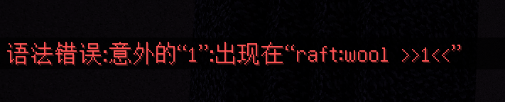

# [2023w02m01a] 命令脚本移除data，脚本接口日常更新

:::info 版本更新
本周官方更新了1.19.70.21版本，[点击这里](/docs/official_changelog/preview/1.19.70.21)查看官方技术更新日志
:::

各位更新好，又到了一周一次的预览版更新，本周的预览版在技术更新方面主要涉及命令、数驱和脚本三个方面的内容，大体上还是日常小改小动。不过话虽如此，其中也不乏一些可能存在深远影响的更改。那么接下来就让我们一起来看看本周官方又给我们更新了什么新特性吧！

## 本周动态速递

- 🎛️ 命令与脚本移除物品data参数，扁平化新阶段？
- 📜 方块加载规则更加日常规范化，参数类型不符直接炸。
- 🗑️ 工作台组件写法简化，和 `tile` 说再见。
- 🔌 函数移除、参数类型更改，脚本接口日常变动。
- 🦦 脚本接口 `Player#playAnimation` 函数加入。

## 一、data退出历史舞台，扁平化进入新阶段？

本周的预览版中，官方移除了对1.19.70版本以上的`/clone`、`/execute`、`/fill`、`/setblock` 和 `/testforblock` 命令以及脚本接口的 `ItemStack` 类中data字段的支持。同时在脚本方面提供了通过字符串新建`ItemStack`对象的方式。这些举措对开发者未来的命令与脚本编写影响还是很大的。

### 命令

首先是命令方面，这里我们借官方给出的例子来简单体会一下：

在以往如果我们想要放置一个橙色的羊毛，我们通常会使用如下命令来进行放置：

````typescript
/setblock ~ ~ ~ minecraft:wool 1
````

其中wool后跟着的1就是橙色羊毛的data值，而现在，这种写法将不再支持。

如果您就是不信这个邪，在新版本中使用了上述写法，则您会得到如下报错：



通过报错信息我们可以明白，问题出在这个“1”上，换言之，游戏引擎已经不认识这个`data`参数了。

那怎么办呢？

这时候，您可以使用状态参数来完成和上面相同的操作：

 ````typescript
 /setblock ~ ~ ~ minecraft:wool ["color":"orange"]
 ````

其中 `color` 是羊毛方块颜色状态的名称。具体每个方块都有什么状态，各位可以在其对应的Minecraft Wiki页面中找到。

执行后得到如下结果：


可以看到橙色羊毛被顺利放置了。

### 脚本

脚本方面主要是 `ItemStack` 类中的 `data` 字段被移除了。

在此之前，如果我们想要创建一个 `ItemStack` 实例，我们可以通过以下方式构造：

```typescript
import {MinecraftItemTypes, ItemStack} from '@minecraft/server';
/**
 * 
 * 
 **/
const itemStack = new ItemStack(MinecraftItemTypes.apple, 1, 0);
```


### 结语

这从某种角度来说，可以说是在扁平化方面向前迈了很大一步，`data`字段的移除，意味着开发者和玩家们必须通过状态参数以及脚本中各个`MinecraftBlockTypes`、`MinecraftItemTypes`类来实现与方块物品的交互。但是，对于这一步说起来可能又没完全迈出去。主要原因


## 二、选择器体积尺寸参数工作机制优化


## 三、数驱日常小修小补，优化编写体验

## 四、脚本接口更新，函数增删，参数类型更改

